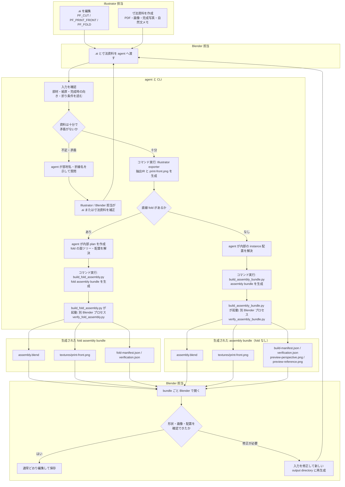

# `.ai` から Blender 組立を確認・編集するまで

Illustrator 担当は展開図を整え、寸法資料とともに Blender 担当へ渡します。Blender 担当はこの二つのファイルを agent へ渡します。人が作るのはこの入力だけで、path note、JSON、XYZ 座標、回転行列を作成・入力する必要はありません。

## 流れの補足

- `.ai` は 1 アートボードに対象の展開図を置き、`PF_CUT`、`PF_PRINT_FRONT`、必要なら `PF_FOLD` を使います。寸法資料には単位、紙厚、部材の関係、完成時の向き、折りがあれば山谷・角度・固定側・順序を記します。詳しい入稿規則は [Illustrator 入稿と寸法資料](operator-intake.md) を参照してください。
- agent は資料が不足または矛盾する場合だけ、たとえば `BODY` の `FOLD_02` の山谷のように具体的に質問します。十分な資料があれば一括の承認待ちはしません。抽出IR、fold の内部 plan、instance 配置はスクリプトと agent が扱う内部ファイルです。
- fold がない部材は `build_assembly_bundle.py` を実行し、同スクリプトが別 Blender プロセスで `verify_assembly_bundle.py` を起動します。対応する直線 fold を持つ部材は `build_fold_assembly.py` を実行し、同スクリプトが別 Blender プロセスで `verify_fold_assembly.py` を起動します。
- 両方の bundle は `assembly.blend`、`textures/print-front.png`、manifest、検証結果を同じディレクトリで扱います。fold なしの `build_assembly_bundle.py` は `preview-perspective.png` と `preview-reference.png` も生成しますが、fold bundle は preview を生成しません。Blender で編集・保存した bundle は、元の検証済み成果物とは異なる状態になるため、入力の修正では新しい出力先へ再生成します。

この工程は、Blender 内で確認・編集できる assembly bundle までを扱います。カメラ、照明、背景、納品用レンダリングは対象外です。直線 fold の対応範囲と内部処理は [資料から直線折りを含む組立を生成する設計](fold-workflow.md)、agent の利用方法は [paper-fixture-assembly skill](../plugins/paper-fixture/skills/paper-fixture-assembly/SKILL.md) を参照してください。
